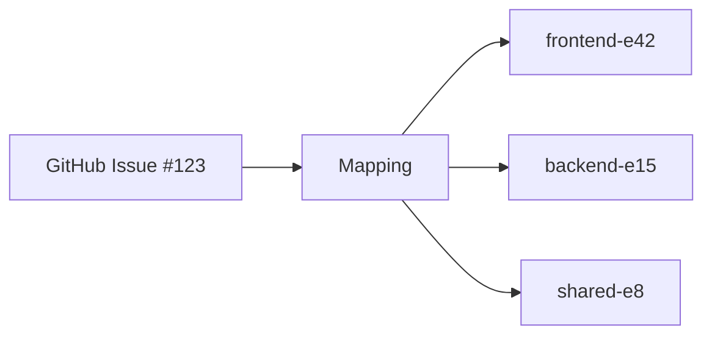

## Skill Overview

This skill bridges Beads (git-backed multi-repository issue tracker) with project management tools like GitHub Projects v2 and Shortcut. It enables teams working across multiple repositories to maintain a unified view of work while preserving detailed technical tracking in Beads.

**How Claude Uses This Skill:**

1. **First use:** Check if CLI is installed, if not: `cd .claude/skills/beads-bridge && npm install && npm run build`
2. **Execute capabilities:** Run commands from the project root (not from the skill directory)
3. **Run commands:** `node .claude/skills/beads-bridge/dist/cli.js <command> <args>`
4. **Parse output:** All commands return JSON that can be presented to the user

**IMPORTANT:** Always run commands from the project root so the CLI can find `.beads-bridge/config.json` automatically.

**GitHub Examples:**
```bash
# From project root (e.g., ~/workspace/pensive)
node .claude/skills/beads-bridge/dist/cli.js status --repository owner/repo --issue 123
node .claude/skills/beads-bridge/dist/cli.js mapping create -r owner/repo -i 123 -e '[{"repository":"pensive","epicId":"pensive-6ac4","repositoryPath":"/path/to/repo"}]'
```

**Shortcut Examples:**
```bash
# From project root (e.g., ~/workspace/pensive)
node .claude/skills/beads-bridge/dist/cli.js shortcut-status --story 89216
node .claude/skills/beads-bridge/dist/cli.js shortcut-mapping create -s 89216 -e '[{"repository":"pensive","epicId":"pensive-8e2d","repositoryPath":"/path/to/repo"}]'
```

### Key Capabilities

Works with both **GitHub Issues/Projects** and **Shortcut Stories**:

1. **Query Status** - Get aggregated progress across issues/stories and Beads epics
2. **Sync Progress** - Post progress updates from Beads to GitHub/Shortcut
3. **Generate Diagrams** - Create Mermaid dependency visualizations
4. **Detect Discoveries** - Identify newly discovered work during implementation
5. **Manage Mappings** - Create/query links between issues/stories and Beads epics
6. **Decompose** - Convert issue/story task lists into Beads epics and tasks
7. **Force Sync** - Immediate synchronization of multiple operations

### Use Cases

- **Tech Leads**: Monitor progress across 5+ repositories from a single GitHub Projects board
- **Product Managers**: Get accurate completion estimates based on actual dependency analysis
- **Engineering Teams**: Automatically propagate discovered work to project tracking
- **Stakeholders**: View real-time progress with auto-updating diagrams and metrics

### How It Works

The skill operates on **mappings** - links between a single GitHub Issue (tracking the initiative) and one or more Beads epics (tracking the technical implementation across repositories).



Each mapping enables:
- Aggregated progress from all repositories
- Dependency trees showing technical relationships
- Scope discovery detection across repos

## Configuration

The skill uses JSON configuration files in `.beads-bridge/config.json`. Initialize with:

```bash
beads-bridge init -r owner/repo  # For GitHub
beads-bridge init -b shortcut -r owner/repo  # For Shortcut
```

### GitHub Configuration Example

```json
{
  "version": "2.0",
  "backend": "github",
  "github": {
    "repository": "acme-corp/product-initiatives"
  },
  "repositories": [
    {
      "name": "frontend",
      "path": "/absolute/path/to/frontend"
    },
    {
      "name": "backend",
      "path": "/absolute/path/to/backend"
    }
  ],
  "logging": {
    "level": "info"
  }
}
```

### Shortcut Configuration Example

```json
{
  "version": "2.0",
  "backend": "shortcut",
  "shortcut": {
    "workspace": "your-workspace-name"
  },
  "repositories": [
    {
      "name": "pensive",
      "path": "/Users/you/workspace/pensive"
    }
  ],
  "logging": {
    "level": "info"
  }
}
```

## Example Usage

### 1. Query Status Across Repositories

```
User: "What's the status of the authentication redesign work in GitHub issue #123?"

Claude uses: query_status
Input: { repository: "acme-corp/product-initiatives", issueNumber: 123 }

Output:
{
  totalTasks: 47,
  completed: 28,
  blockers: [
    { id: "backend-t156", title: "OAuth token refresh race condition" },
    { id: "frontend-t203", title: "Session storage encryption key rotation" }
  ]
}
```

### 2. Sync Progress Updates

```
User: "Update progress for issue #123"

Claude uses: sync_progress
Input: {
  repository: "acme-corp/product-initiatives",
  issueNumber: 123
}

Output:
Posts a comment with diagram-first structure:
```

**Progress Comment Format:**

```markdown
## 📸 Dependency Diagram

[Mermaid flowchart showing current state with completion checkboxes]
- ☑ = Completed tasks
- 🔄 = In progress tasks
- ☐ = Open tasks
- Dotted lines = discovered/blocking relationships
- Orange borders = recently discovered work

---

## Progress Update

[Visual progress bar]

**Overall:** X/Y tasks completed (Z%)

### Summary
- ✅ Completed: X
- 🔄 In Progress: Y
- 🚧 Blocked: Z
- 📝 Open: W

### Recently Completed
- ✅ task-1: Description
- ✅ task-2: Description

### In Progress
- 🔄 task-3: Description

### Metrics (when available)
- **Velocity:** X.Y tasks/day
- **Estimated completion:** Date
- **Risk level:** Low/Medium/High

---
*Last updated: Timestamp*
```

**Why Diagram First:**
- Visual context before numerical details
- Enables quick scanning without scrolling
- Shows relationships and dependencies immediately
- PM sees "what" before "how much"

**Diagram Features:**
- Uses `bd dep tree --format mermaid --reverse` for consistency
- Completion status shown with checkboxes (☑/☐)
- Discovered work highlighted with orange borders
- Blocking relationships shown as dotted lines
- Updates automatically as tasks complete

### 3. Generate Standalone Diagram

```
User: "Show me the dependency tree for issue #123"

Claude uses: generate_diagrams
Input: {
  repository: "acme-corp/product-initiatives",
  issueNumber: 123,
  placement: "comment"
}

Output:
Creates a standalone Mermaid diagram comment (without progress details):
- All epics and their child tasks
- Dependencies between tasks
- Status with completion checkboxes
- Cross-repository relationships
```

### 4. Detect Scope Discoveries

```
User: "Check if any new work was discovered during implementation of #123"

Claude uses: detect_discoveries
Input: { repository: "acme-corp/product-initiatives", issueNumber: 123 }

Output:
{
  discoveries: [
    {
      issueId: "frontend-t244",
      title: "Need mobile app session sync",
      discoveredFrom: "frontend-t203",
      priority: "high",
      impact: {
        timelineImpact: 5,  // days
        criticalPath: true,
        crossRepo: true  // Also affects backend
      }
    }
  ],
  totalCount: 4,
  highPriority: 1,
  mediumPriority: 2,
  lowPriority: 1
}
```

### 5. Create Mapping

```
User: "Link GitHub issue #456 to frontend-e99 and backend-e42"

Claude uses: manage_mappings
Input: {
  repository: "acme-corp/product-initiatives",
  issueNumber: 456,
  action: "create",
  epicIds: [
    { repository: "frontend", epicId: "frontend-e99", repositoryPath: "../frontend" },
    { repository: "backend", epicId: "backend-e42", repositoryPath: "../backend" }
  ]
}

Output:
{
  mappingId: "uuid-...",
  epicsLinked: 2
}
```

### 6. Decompose GitHub Issue into Beads Tasks

```
User: "Decompose GitHub issue #789 into Beads epics and tasks"

Claude uses: decompose
Input: {
  repository: "acme-corp/product-initiatives",
  issueNumber: 789
}

Output:
{
  epics: [
    {
      repository: "frontend",
      epicId: "frontend-e105",
      taskCount: 5
    },
    {
      repository: "backend",
      epicId: "backend-e67",
      taskCount: 3
    }
  ],
  mappingId: "uuid-...",
  commentPosted: true,
  totalTasks: 8
}
```

**How it works:**

The decompose command parses the GitHub issue body for task lists and creates:
1. A Beads epic per repository (identified by `[repo-name]` prefix in tasks)
2. Individual Beads tasks under each epic
3. A mapping linking the GitHub issue to all created epics
4. A confirmation comment on the GitHub issue with the mapping details

**Task list format in GitHub issues:**
```markdown
## Tasks

- [ ] [frontend] Add login form component
- [ ] [frontend] Implement OAuth callback handler
- [ ] [backend] Create user authentication endpoint
- [ ] [backend] Add JWT token generation
- [ ] [shared-lib] Update auth types
- [x] [frontend] Design authentication flow (already completed)
```

**Repository prefix rules:**
- `[repo-name]` must match a repository configured in `config.yaml`
- Tasks without prefixes are assigned to the default repository
- Already completed tasks (`[x]`) are created as closed in Beads
- Epic title matches the GitHub issue title
- Epic description includes link back to GitHub issue

### 7. Force Immediate Sync

```
User: "Sync everything for issue #123 right now"

Claude uses: force_sync
Input: {
  repository: "acme-corp/product-initiatives",
  issueNumber: 123,
  operations: ["progress", "diagram", "discovery"]
}

Output:
{
  results: {
    progress: true,    // Updated progress comment
    diagram: true,     // Updated dependency diagram
    discovery: true    // Posted new discoveries
  }
}
```

### 8. Shortcut Story Status Query

```
User: "What's the status of Shortcut story 89216?"

Claude runs: node dist/cli.js shortcut-status -s 89216

Output:
{
  "success": true,
  "data": {
    "totalTasks": 12,
    "completed": 5,
    "inProgress": 3,
    "blocked": 1,
    "open": 3,
    "percentComplete": 42,
    "repositories": [
      {
        "name": "pensive",
        "epicId": "pensive-8e2d",
        "completed": 5,
        "total": 12
      }
    ],
    "blockers": [
      {
        "id": "pensive-6ac4.9",
        "title": "Need API credentials from customer"
      }
    ]
  }
}
```

### 9. Create Shortcut Mapping

```
User: "Link Shortcut story 89216 to Beads epic pensive-8e2d"

Claude runs:
node dist/cli.js shortcut-mapping create \
  -s 89216 \
  -e '[{"repository":"pensive","epicId":"pensive-8e2d","repositoryPath":"/absolute/path/to/pensive"}]'

Output:
{
  "success": true,
  "data": {
    "mappingId": "1bd2b0b3-c938-4ff4-834e-500d0575689a",
    "epicsLinked": 1
  }
}
```

## Implementation Architecture

### Command Line Interface

The skill provides the `beads-bridge` CLI for executing capabilities with both GitHub and Shortcut:

#### GitHub Commands

```bash
# Query status
beads-bridge status --repository owner/repo --issue 123

# Query status with blockers
beads-bridge status --repository owner/repo --issue 123 --blockers

# Sync progress
beads-bridge sync --repository owner/repo --issue 123

# Generate diagram (in comment)
beads-bridge diagram --repository owner/repo --issue 123

# Generate diagram (in description)
beads-bridge diagram --repository owner/repo --issue 123 --placement description

# Detect discoveries
beads-bridge discoveries --repository owner/repo --issue 123

# Get existing mapping
beads-bridge mapping get --repository owner/repo --issue 456

# Create mapping
beads-bridge mapping create \
  --repository owner/repo \
  --issue 456 \
  --epics '[
    {"repository":"frontend","epicId":"frontend-e99","repositoryPath":"../frontend"},
    {"repository":"backend","epicId":"backend-e42","repositoryPath":"../backend"}
  ]'

# Force sync all operations
beads-bridge force-sync --repository owner/repo --issue 123

# Force sync specific operations
beads-bridge force-sync --repository owner/repo --issue 123 --operations progress,diagram

# Decompose GitHub issue into Beads epics and tasks
beads-bridge decompose --repository owner/repo --issue 789

# Decompose without posting confirmation comment
beads-bridge decompose --repository owner/repo --issue 789 --no-comment

# Decompose with custom priority for created beads
beads-bridge decompose --repository owner/repo --issue 789 --priority 1

# Decompose and skip already completed tasks
beads-bridge decompose --repository owner/repo --issue 789 --skip-completed
```

#### Shortcut Commands

```bash
# Query status for Shortcut story
beads-bridge shortcut-status --story 89216

# Query status with blockers
beads-bridge shortcut-status --story 89216 --blockers

# Get existing mapping
beads-bridge shortcut-mapping get --story 89216

# Create mapping between Shortcut story and Beads epics
beads-bridge shortcut-mapping create \
  --story 89216 \
  --epics '[
    {"repository":"pensive","epicId":"pensive-8e2d","repositoryPath":"/Users/you/workspace/pensive"}
  ]'

# Decompose Shortcut story into Beads epics and tasks
beads-bridge shortcut-decompose --story 89216

# Decompose without posting confirmation comment
beads-bridge shortcut-decompose --story 89216 --no-comment

# Decompose with custom priority for created beads
beads-bridge shortcut-decompose --story 89216 --priority 1
```

**Global Options:**
- `-c, --config <path>` - Path to config file (default: `config.yaml`)
- `-h, --help` - Show help for any command
- `-V, --version` - Show CLI version

**Output Format:**

All commands return JSON:

**Success:**
```json
{
  "success": true,
  "data": { /* capability-specific data */ }
}
```

**Error:**
```json
{
  "success": false,
  "error": {
    "code": "ERROR_CODE",
    "message": "Human-readable error message"
  }
}
```

Exit codes: `0` for success, `1` for failure.

### Components

1. **BeadsClient** - Reads issues/epics from git repositories using `bd` CLI
2. **GitHubBackend** - Manages GitHub Issues and Projects v2 via `gh` CLI
3. **MappingStore** - Persists GitHub↔Beads relationships in git-tracked JSON
4. **ProgressSynthesizer** - Aggregates metrics across repositories
5. **MermaidGenerator** - Creates dependency tree visualizations
6. **DiagramPlacer** - Updates GitHub issue descriptions or comments
7. **ScopeDiscoveryDetector** - Finds newly discovered work

### Data Flow

```
query_status request
  → Lookup mapping (GitHub #123 → Beads epics)
  → For each epic:
      → Get dependency tree from Beads
      → Calculate metrics (completed/blocked/in-progress)
  → Aggregate across all epics
  → Return unified status
```

### Scheduling (Optional)

The skill can be configured to run automatically:

```yaml
sync:
  schedule:
    enabled: true
    cronExpression: "0 */2 * * *"  # Every 2 hours
    workHours:
      enabled: true
      timezone: "America/Los_Angeles"
      startHour: 9
      endHour: 18
      workHourInterval: 30      # 30 min during work hours
      offHoursInterval: 240     # 4 hours off-hours
```

## Best Practices

### For Product Managers

1. **Create mappings early** - Link GitHub Issues to Beads epics at initiative start
2. **Review discoveries weekly** - Check `detect_discoveries` output during standups

### For Tech Leads

1. **Keep diagrams current** - Run `generate_diagrams` after major scope changes
2. **Track blockers actively** - Use `query_status` with `includeBlockers: true`
3. **Verify cross-repo deps** - Discovery detector flags missing coordination

### For Engineering Teams

1. **Use Beads for technical work** - Detailed tracking stays in repositories
2. **Let sync handle GitHub** - Don't manually update tracking issues
3. **Tag discoveries properly** - Beads issues with `discovered-from` relationships

## Troubleshooting

### "No mapping found for repository#issue"

Create a mapping first:
```
manage_mappings with action: "create"
```

### "Permission denied when accessing repository"

Ensure:
1. Repository paths in config are correct
2. You have read access to all Beads repositories
3. `bd` CLI is installed and working

### Diagrams not updating

Check:
1. GitHub token has write access to repository
2. `gh` CLI is authenticated: `gh auth status`
3. Issue exists and is accessible

### Velocity metrics seem wrong

Verify:
1. Mapping includes all relevant Beads epics
2. Epic dependency trees are complete
3. Issue statuses are up to date in Beads

## Installation

### Prerequisites

- Node.js >= 18.0.0
- npm or pnpm
- **No CLI tools required** (gh and short are no longer needed)

### Installation

```bash
npm install -g beads-bridge
```

### Authentication

**GitHub:**

```bash
beads-bridge auth github
```

Follow the prompts to authenticate via OAuth device flow.

**Shortcut:**

```bash
beads-bridge auth shortcut
```

Enter your Shortcut API token when prompted.

**Verify:**

```bash
beads-bridge auth status
```

### Configuration

See [Configuration Guide](docs/CONFIGURATION.md) for config file setup.

**For Claude (Automated Setup):**

When Claude first uses this skill, it should automatically install and build the CLI:

```bash
# Navigate to skill directory
cd .claude/skills/beads-bridge

# Check if already installed
if [ ! -d "node_modules" ]; then
  echo "Installing beads-bridge skill dependencies..."
  pnpm install
  pnpm run build
fi

# Verify CLI is available
pnpm exec beads-bridge --version
```

## Requirements

- **Node.js** >= 18.0.0
- **Beads CLI** (`bd`) >= v0.21.3 installed and in PATH
  - **Important**: v0.21.3+ required for scope discovery detection feature
  - This version includes the `dependency_type` field in `bd show --json` output
  - Earlier versions will cause discovery detection to fail
- Git repositories with Beads tracking initialized (`.beads/` directory)
- **For GitHub**: GitHub Projects v2 board (classic projects not supported)
- **For Shortcut**: Shortcut workspace with configured workflow states

**Authentication**: No CLI tools required. Use built-in OAuth:
```bash
beads-bridge auth github    # OAuth device flow
beads-bridge auth shortcut  # API token
```

## Error Codes

- `VALIDATION_ERROR` - Invalid input parameters
- `NOT_FOUND` - Mapping or resource doesn't exist
- `EXECUTION_ERROR` - Operation failed during execution
- `AUTHENTICATION_ERROR` - Not authenticated with backend (run `beads-bridge auth`)
- `RATE_LIMIT_ERROR` - API rate limit exceeded

## Performance

- Query status: ~500ms per epic (cached locally)
- Generate diagram: ~1-2s for 50 nodes
- Detect discoveries: ~300ms per epic
- Sync operations: Parallelized across epics (3 concurrent max)

## Security

- Credentials stored separately from config
- Encrypted using AES-256-GCM with machine-specific key
- OAuth tokens refreshable via `beads-bridge auth` commands
- Location: `~/.config/beads-bridge/credentials.json` (encrypted)
- Mapping data stored in git-tracked files (not secrets)
- No external services or network calls except GitHub API

## Contributing

See the main repository README for contribution guidelines.

## License

MIT
