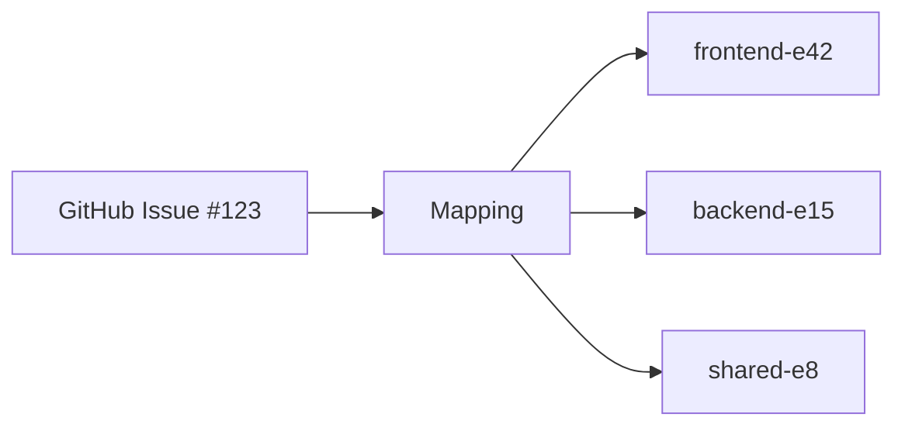

## Skill Overview

This skill bridges Beads (git-backed multi-repository issue tracker) with project management tools like GitHub Projects v2 and Shortcut. It enables teams working across multiple repositories to maintain a unified view of work while preserving detailed technical tracking in Beads.

**How Claude Uses This Skill:**

1. **First use:** Check if CLI is installed, if not: `cd .claude/skills/beads-bridge && npm install && npm run build`
2. **Execute capabilities:** Run commands from the project root (not from the skill directory)
3. **Run commands:** `node .claude/skills/beads-bridge/dist/cli.js <command> <args>`
4. **Parse output:** All commands return JSON that can be presented to the user

**IMPORTANT:** Always run commands from the project root so the CLI can find `.beads-bridge/config.json` automatically.

**GitHub Examples:**
```bash
# From project root (e.g., ~/workspace/pensive)
node .claude/skills/beads-bridge/dist/cli.js status --repository owner/repo --issue 123
node .claude/skills/beads-bridge/dist/cli.js mapping create -r owner/repo -i 123 -e '[{"repository":"pensive","epicId":"pensive-6ac4","repositoryPath":"/path/to/repo"}]'
```

**Shortcut Examples:**
```bash
# From project root (e.g., ~/workspace/pensive)
node .claude/skills/beads-bridge/dist/cli.js shortcut-status --story 89216
node .claude/skills/beads-bridge/dist/cli.js shortcut-mapping create -s 89216 -e '[{"repository":"pensive","epicId":"pensive-8e2d","repositoryPath":"/path/to/repo"}]'
```

### Key Capabilities

Works with both **GitHub Issues/Projects** and **Shortcut Stories**:

1. **Query Status** - Get aggregated progress across issues/stories and Beads epics
2. **Sync Progress** - Post progress updates from Beads to GitHub/Shortcut
3. **Generate Diagrams** - Create Mermaid dependency visualizations
4. **Detect Discoveries** - Identify newly discovered work during implementation
5. **Manage Mappings** - Create/query links between issues/stories and Beads epics
6. **Decompose** - Convert issue/story task lists into Beads epics and tasks
7. **Force Sync** - Immediate synchronization of multiple operations

### Use Cases

- **Tech Leads**: Monitor progress across 5+ repositories from a single GitHub Projects board
- **Product Managers**: Get accurate completion estimates based on actual dependency analysis
- **Engineering Teams**: Automatically propagate discovered work to project tracking
- **Stakeholders**: View real-time progress with auto-updating diagrams and metrics

### How It Works

The skill operates on **mappings** - links between a single GitHub Issue (tracking the initiative) and one or more Beads epics (tracking the technical implementation across repositories).



Each mapping enables:
- Aggregated progress from all repositories
- Dependency trees showing technical relationships
- Scope discovery detection across repos

## Configuration

The skill uses JSON configuration files in `.beads-bridge/config.json`. Initialize with:

```bash
beads-bridge init -r owner/repo  # For GitHub
beads-bridge init -b shortcut -r owner/repo  # For Shortcut
```

### GitHub Configuration Example

```json
{
  "version": "2.0",
  "backend": "github",
  "github": {
    "repository": "acme-corp/product-initiatives"
  },
  "repositories": [
    {
      "name": "frontend",
      "path": "/absolute/path/to/frontend"
    },
    {
      "name": "backend",
      "path": "/absolute/path/to/backend"
    }
  ],
  "logging": {
    "level": "info"
  }
}
```

### Shortcut Configuration Example

```json
{
  "version": "2.0",
  "backend": "shortcut",
  "shortcut": {
    "workspace": "your-workspace-name"
  },
  "repositories": [
    {
      "name": "pensive",
      "path": "/Users/you/workspace/pensive"
    }
  ],
  "logging": {
    "level": "info"
  }
}
```

## Example Usage

### 1. Query Status Across Repositories

```
User: "What's the status of the authentication redesign work in GitHub issue #123?"

Claude uses: query_status
Input: { repository: "acme-corp/product-initiatives", issueNumber: 123 }

Output:
{
  totalTasks: 47,
  completed: 28,
  blockers: [
    { id: "backend-t156", title: "OAuth token refresh race condition" },
    { id: "frontend-t203", title: "Session storage encryption key rotation" }
  ]
}
```

### 2. Sync Progress Updates

When syncing progress to GitHub/Shortcut:

```
User: "Update progress for issue #123"

Claude uses: sync_progress
Input: {
  repository: "owner/repo",
  issueNumber: 123,
  userNarrative: "Waiting for design review" // optional
}
```

**Shortcut Stories**: Updates story description with "Yak Map" section + posts narrative comment

**GitHub Issues**: Posts progress comment with metrics and diagrams

See [CLI Reference](docs/CLI_REFERENCE.md) for complete command syntax.

### 3. Generate Standalone Diagram

```
User: "Show me the dependency tree for issue #123"

Claude uses: generate_diagrams
Input: {
  repository: "acme-corp/product-initiatives",
  issueNumber: 123,
  placement: "comment"
}

Output:
Creates a standalone Mermaid diagram comment (without progress details):
- All epics and their child tasks
- Dependencies between tasks
- Status with completion checkboxes
- Cross-repository relationships
```

### 4. Detect Scope Discoveries

```
User: "Check if any new work was discovered during implementation of #123"

Claude uses: detect_discoveries
Input: { repository: "acme-corp/product-initiatives", issueNumber: 123 }

Output:
{
  discoveries: [
    {
      issueId: "frontend-t244",
      title: "Need mobile app session sync",
      discoveredFrom: "frontend-t203",
      priority: "high",
      impact: {
        timelineImpact: 5,  // days
        criticalPath: true,
        crossRepo: true
      }
    }
  ],
  totalCount: 4,
  highPriority: 1
}
```

### 5. Create Mapping

```
User: "Link GitHub issue #456 to frontend-e99 and backend-e42"

Claude uses: manage_mappings
Input: {
  repository: "acme-corp/product-initiatives",
  issueNumber: 456,
  action: "create",
  epicIds: [
    { repository: "frontend", epicId: "frontend-e99", repositoryPath: "../frontend" },
    { repository: "backend", epicId: "backend-e42", repositoryPath: "../backend" }
  ]
}

Output:
{
  mappingId: "uuid-...",
  epicsLinked: 2
}
```

### 6. Decompose Issue into Beads Tasks

```
User: "Decompose GitHub issue #789 into Beads epics and tasks"

Claude uses: decompose
Input: {
  repository: "acme-corp/product-initiatives",
  issueNumber: 789
}

Output:
{
  epics: [
    {
      repository: "frontend",
      epicId: "frontend-e105",
      taskCount: 5
    },
    {
      repository: "backend",
      epicId: "backend-e67",
      taskCount: 3
    }
  ],
  mappingId: "uuid-...",
  commentPosted: true,
  totalTasks: 8
}
```

**How it works:**

The decompose command parses the GitHub issue body for task lists and creates:
1. A Beads epic per repository (identified by `[repo-name]` prefix in tasks)
2. Individual Beads tasks under each epic
3. A mapping linking the GitHub issue to all created epics
4. A confirmation comment on the GitHub issue with the mapping details

**Task list format in GitHub issues:**
```markdown
## Tasks

- [ ] [frontend] Add login form component
- [ ] [frontend] Implement OAuth callback handler
- [ ] [backend] Create user authentication endpoint
- [ ] [backend] Add JWT token generation
- [ ] [shared-lib] Update auth types
- [x] [frontend] Design authentication flow (already completed)
```

**Repository prefix rules:**
- `[repo-name]` must match a repository configured in `config.yaml`
- Tasks without prefixes are assigned to the default repository
- Already completed tasks (`[x]`) are created as closed in Beads
- Epic title matches the GitHub issue title
- Epic description includes link back to GitHub issue

### 7. Force Immediate Sync

```
User: "Sync everything for issue #123 right now"

Claude uses: force_sync
Input: {
  repository: "acme-corp/product-initiatives",
  issueNumber: 123,
  operations: ["progress", "diagram", "discovery"]
}

Output:
{
  results: {
    progress: true,    // Updated progress comment
    diagram: true,     // Updated dependency diagram
    discovery: true    // Posted new discoveries
  }
}
```

## Command Reference

For complete CLI command syntax and all available options, see:
- **[CLI Reference](docs/CLI_REFERENCE.md)** - All commands, options, and output formats

Quick reference:

**GitHub:**
```bash
beads-bridge status --repository owner/repo --issue 123
beads-bridge sync --repository owner/repo --issue 123
beads-bridge diagram --repository owner/repo --issue 123
beads-bridge mapping create -r owner/repo -i 123 -e '[...]'
```

**Shortcut:**
```bash
beads-bridge shortcut-status --story 89216
beads-bridge shortcut-mapping create -s 89216 -e '[...]'
```

## Best Practices

### For Product Managers

1. **Create mappings early** - Link GitHub Issues to Beads epics at initiative start
2. **Review discoveries weekly** - Check `detect_discoveries` output during standups

### For Tech Leads

1. **Keep diagrams current** - Run `generate_diagrams` after major scope changes
2. **Track blockers actively** - Use `query_status` with `includeBlockers: true`
3. **Verify cross-repo deps** - Discovery detector flags missing coordination

### For Engineering Teams

1. **Use Beads for technical work** - Detailed tracking stays in repositories
2. **Let sync handle GitHub** - Don't manually update tracking issues
3. **Tag discoveries properly** - Beads issues with `discovered-from` relationships

## Troubleshooting

For detailed troubleshooting, see [Troubleshooting Guide](docs/TROUBLESHOOTING.md).

### Quick Fixes

**"No mapping found"**: Create a mapping with `mapping create` command

**"Permission denied"**: Verify repository paths in config and ensure Beads is initialized

**Diagrams not updating**: Check GitHub token permissions with `gh auth status`

**Discovery detection failing**: Ensure Beads CLI >= v0.21.3

For more issues and solutions, see the [complete troubleshooting guide](docs/TROUBLESHOOTING.md).

## Installation & Requirements

**Quick Start:**
```bash
# Global installation
npm install -g beads-bridge

# Authenticate
beads-bridge auth github
beads-bridge auth shortcut

# Initialize config
beads-bridge init --repository owner/repo
```

**Requirements:**
- Node.js >= 18.0.0
- Beads CLI (`bd`) >= v0.21.3
- Git repositories with Beads initialized

For complete installation instructions, authentication setup, and configuration details, see:
- **[Installation Guide](docs/INSTALLATION.md)** - Full setup and configuration

**For Claude (Automated Setup):**

When Claude first uses this skill, it should automatically install and build:

```bash
cd .claude/skills/beads-bridge

if [ ! -d "node_modules" ]; then
  echo "Installing beads-bridge skill dependencies..."
  pnpm install
  pnpm run build
fi

pnpm exec beads-bridge --version
```

## Additional Documentation

- **[Architecture](docs/ARCHITECTURE.md)** - Implementation details, components, and data flow
- **[CLI Reference](docs/CLI_REFERENCE.md)** - Complete command syntax and options
- **[Installation Guide](docs/INSTALLATION.md)** - Setup, authentication, and configuration
- **[Troubleshooting](docs/TROUBLESHOOTING.md)** - Common issues and solutions

## Performance

- Query status: ~500ms per epic (cached locally)
- Generate diagram: ~1-2s for 50 nodes
- Detect discoveries: ~300ms per epic
- Sync operations: Parallelized across epics (3 concurrent max)

## Security

- Credentials stored separately from config
- Encrypted using AES-256-GCM with machine-specific key
- OAuth tokens refreshable via `beads-bridge auth` commands
- Location: `~/.config/beads-bridge/credentials.json` (encrypted)
- Mapping data stored in git-tracked files (not secrets)
- No external services or network calls except GitHub/Shortcut API

## Contributing

See the main repository README for contribution guidelines.

## License

MIT
