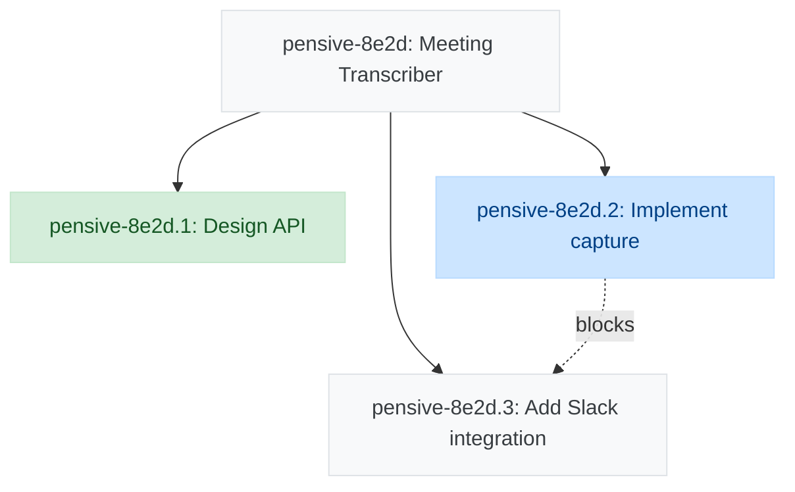

# Beads-Bridge Shortcut Sync Format Improvements - Implementation Plan

> **For Claude:** REQUIRED SUB-SKILL: Use superpowers:executing-plans to implement this plan task-by-task.

**Goal:** Implement improved Shortcut story sync format with diagrams in description "Yak Map" section and narrative-only progress comments

**Architecture:** Create ShortcutSyncOrchestrator to coordinate complete sync workflow (read Beads state → generate diagram → update description Yak Map section → post narrative comment). Use fail-fast error handling. Start Shortcut-specific, extract common patterns later when GitHub adopts similar changes.

**Tech Stack:** TypeScript, Vitest, Beads CLI, Shortcut API, Mermaid diagrams

**Base Directory:** `workspace/wellmaintained-skills/plugins/beads-bridge/skills/beads-bridge/`

---

## Task 1: Create section-updater utility

**Files:**
- Create: `src/utils/section-updater.ts`
- Create: `tests/utils/section-updater.test.ts`

**Step 1: Write failing test for finding section**

Create test file:
```typescript
// tests/utils/section-updater.test.ts
import { describe, it, expect } from 'vitest';
import { findSection, updateSection, appendSection } from '../../src/utils/section-updater.js';

describe('section-updater', () => {
  describe('findSection', () => {
    it('should find section between markers', () => {
      const markdown = `# Story Description

Some content here.

<!-- YAK_MAP_START -->
---
## Yak Map

Old diagram content
<!-- YAK_MAP_END -->`;

      const result = findSection(markdown, 'YAK_MAP_START', 'YAK_MAP_END');

      expect(result.found).toBe(true);
      expect(result.content).toContain('Old diagram content');
      expect(result.startIndex).toBeGreaterThan(0);
      expect(result.endIndex).toBeGreaterThan(result.startIndex);
    });

    it('should return not found when markers missing', () => {
      const markdown = `# Story Description

No markers here.`;

      const result = findSection(markdown, 'YAK_MAP_START', 'YAK_MAP_END');

      expect(result.found).toBe(false);
    });
  });
});
```

**Step 2: Run test to verify it fails**

Run: `cd workspace/wellmaintained-skills/plugins/beads-bridge/skills/beads-bridge && npm test -- section-updater.test.ts`

Expected: FAIL - "Cannot find module '../../src/utils/section-updater.js'"

**Step 3: Write minimal implementation**

Create implementation file:
```typescript
// src/utils/section-updater.ts

/**
 * Result of finding a section in markdown
 */
export interface SectionFindResult {
  found: boolean;
  content?: string;
  startIndex?: number;
  endIndex?: number;
}

/**
 * Find a section between HTML comment markers
 */
export function findSection(
  markdown: string,
  startMarker: string,
  endMarker: string
): SectionFindResult {
  const startComment = `<!-- ${startMarker} -->`;
  const endComment = `<!-- ${endMarker} -->`;

  const startIndex = markdown.indexOf(startComment);
  const endIndex = markdown.indexOf(endComment);

  if (startIndex === -1 || endIndex === -1 || endIndex <= startIndex) {
    return { found: false };
  }

  const content = markdown.substring(
    startIndex + startComment.length,
    endIndex
  );

  return {
    found: true,
    content,
    startIndex,
    endIndex: endIndex + endComment.length
  };
}

/**
 * Update section between markers
 */
export function updateSection(
  markdown: string,
  startMarker: string,
  endMarker: string,
  newContent: string
): string {
  const result = findSection(markdown, startMarker, endMarker);

  if (!result.found) {
    throw new Error(`Section markers ${startMarker}/${endMarker} not found`);
  }

  const startComment = `<!-- ${startMarker} -->`;
  const endComment = `<!-- ${endMarker} -->`;

  const before = markdown.substring(0, result.startIndex! + startComment.length);
  const after = markdown.substring(result.endIndex!);

  return before + '\n' + newContent + '\n' + endComment + after;
}

/**
 * Append section to end of markdown
 */
export function appendSection(
  markdown: string,
  startMarker: string,
  endMarker: string,
  content: string
): string {
  const startComment = `<!-- ${startMarker} -->`;
  const endComment = `<!-- ${endMarker} -->`;

  // Add newlines if markdown doesn't end with one
  const separator = markdown.endsWith('\n') ? '\n' : '\n\n';

  return markdown + separator + startComment + '\n' + content + '\n' + endComment;
}
```

**Step 4: Run test to verify it passes**

Run: `cd workspace/wellmaintained-skills/plugins/beads-bridge/skills/beads-bridge && npm test -- section-updater.test.ts`

Expected: PASS

**Step 5: Add tests for updateSection**

Add to test file:
```typescript
  describe('updateSection', () => {
    it('should update existing section content', () => {
      const markdown = `# Story

<!-- YAK_MAP_START -->
Old content
<!-- YAK_MAP_END -->`;

      const newContent = 'New content here';
      const result = updateSection(markdown, 'YAK_MAP_START', 'YAK_MAP_END', newContent);

      expect(result).toContain('New content here');
      expect(result).not.toContain('Old content');
      expect(result).toContain('<!-- YAK_MAP_START -->');
      expect(result).toContain('<!-- YAK_MAP_END -->');
    });

    it('should throw error when section not found', () => {
      const markdown = `# Story

No markers here`;

      expect(() => {
        updateSection(markdown, 'YAK_MAP_START', 'YAK_MAP_END', 'New content');
      }).toThrow('Section markers YAK_MAP_START/YAK_MAP_END not found');
    });
  });
```

**Step 6: Run tests**

Run: `cd workspace/wellmaintained-skills/plugins/beads-bridge/skills/beads-bridge && npm test -- section-updater.test.ts`

Expected: PASS

**Step 7: Add tests for appendSection**

Add to test file:
```typescript
  describe('appendSection', () => {
    it('should append section to end of markdown', () => {
      const markdown = `# Story

Existing content`;

      const content = 'New section content';
      const result = appendSection(markdown, 'YAK_MAP_START', 'YAK_MAP_END', content);

      expect(result).toContain('Existing content');
      expect(result).toContain('<!-- YAK_MAP_START -->');
      expect(result).toContain('New section content');
      expect(result).toContain('<!-- YAK_MAP_END -->');
    });

    it('should handle markdown without trailing newline', () => {
      const markdown = '# Story';

      const content = 'Content';
      const result = appendSection(markdown, 'YAK_MAP_START', 'YAK_MAP_END', content);

      expect(result).toContain('# Story');
      expect(result).toContain('<!-- YAK_MAP_START -->');
    });
  });
```

**Step 8: Run tests**

Run: `cd workspace/wellmaintained-skills/plugins/beads-bridge/skills/beads-bridge && npm test -- section-updater.test.ts`

Expected: PASS (all tests)

**Step 9: Commit**

```bash
cd workspace/wellmaintained-skills/plugins/beads-bridge/skills/beads-bridge
git add src/utils/section-updater.ts tests/utils/section-updater.test.ts
git commit -m "feat: add section-updater utility for markdown sections

- findSection: locate content between HTML comment markers
- updateSection: replace existing section content
- appendSection: add new section to end of markdown
- Comprehensive test coverage"
```

---

## Task 2: Create sync types

**Files:**
- Create: `src/types/sync.ts`

**Step 1: Write type definitions**

Create file:
```typescript
// src/types/sync.ts

/**
 * Options for syncing a Shortcut story
 */
export interface SyncOptions {
  /** Optional user-provided narrative to append to auto-generated content */
  userNarrative?: string;
}

/**
 * Result of a sync operation
 */
export interface SyncResult {
  /** Whether sync was successful */
  success: boolean;

  /** Story ID that was synced */
  storyId: number;

  /** URL of the updated story */
  storyUrl?: string;

  /** URL of the posted comment */
  commentUrl?: string;

  /** Error message if sync failed */
  error?: string;

  /** Timestamp of sync operation */
  syncedAt: string;
}

/**
 * Narrative sections generated from Beads state
 */
export interface NarrativeSections {
  /** Summary of what changed */
  summary: string;

  /** List of current blockers */
  blockers: string[];

  /** List of what's next */
  whatsNext: string[];
}
```

**Step 2: Commit**

```bash
cd workspace/wellmaintained-skills/plugins/beads-bridge/skills/beads-bridge
git add src/types/sync.ts
git commit -m "feat: add sync types for Shortcut sync orchestrator

- SyncOptions: user narrative option
- SyncResult: success/error tracking
- NarrativeSections: auto-generated narrative structure"
```

---

## Task 3: Update MermaidGenerator with live dashboard colors

**Files:**
- Modify: `src/diagrams/mermaid-generator.ts:1-89`
- Modify: `tests/mermaid-generator.test.ts`

**Step 1: Write failing test for color scheme**

Add to existing test file:
```typescript
// tests/mermaid-generator.test.ts
// Add this test to the existing describe block

  it('should include live dashboard color scheme in diagram', async () => {
    mockBeads.getBdCli = vi.fn().mockReturnValue({
      exec: vi.fn().resolvedValue({
        stdout: `graph TD
  task1["Task 1"]:::completed
  task2["Task 2"]:::in_progress`
      })
    });

    const diagram = await generator.generate('pensive', 'pensive-8e2d');

    // Should include classDef with live dashboard colors
    expect(diagram).toContain('classDef completed fill:#d4edda,stroke:#c3e6cb,color:#155724');
    expect(diagram).toContain('classDef in_progress fill:#cce5ff,stroke:#b8daff,color:#004085');
    expect(diagram).toContain('classDef blocked fill:#f8d7da,stroke:#f5c6cb,color:#721c24');
    expect(diagram).toContain('classDef default fill:#f8f9fa,stroke:#dee2e6,color:#383d41');
  });
```

**Step 2: Run test to verify it fails**

Run: `cd workspace/wellmaintained-skills/plugins/beads-bridge/skills/beads-bridge && npm test -- mermaid-generator.test.ts`

Expected: FAIL - Colors not found in diagram

**Step 3: Update MermaidGenerator to add colors**

Modify the file:
```typescript
// src/diagrams/mermaid-generator.ts

/**
 * Mermaid Diagram Generator
 *
 * Uses bd CLI's built-in Mermaid diagram generation via:
 * bd dep tree --format mermaid --reverse
 *
 * Adds custom color scheme matching live dashboard webview.
 */

import type { BeadsClient } from '../clients/beads-client.js';
import type { MermaidOptions } from '../types/diagram.js';

/**
 * Live dashboard color scheme (from src/frontend/dashboard.js:139-142)
 */
const LIVE_DASHBOARD_COLORS = `
  classDef completed fill:#d4edda,stroke:#c3e6cb,color:#155724;
  classDef in_progress fill:#cce5ff,stroke:#b8daff,color:#004085;
  classDef blocked fill:#f8d7da,stroke:#f5c6cb,color:#721c24;
  classDef default fill:#f8f9fa,stroke:#dee2e6,color:#383d41;
`.trim();

/**
 * Default options for Mermaid diagram generation
 */
const DEFAULT_OPTIONS: Required<MermaidOptions> = {
  maxNodes: 50,
  includeLegend: true,
  groupByRepository: true,
  direction: 'TB',
  repositories: [],
  statuses: []
};

/**
 * MermaidGenerator creates visual dependency diagrams using bd CLI
 */
export class MermaidGenerator {
  constructor(private readonly beads: BeadsClient) {}

  /**
   * Generate a Mermaid diagram from a dependency tree
   *
   * Uses bd's built-in diagram generation:
   * bd dep tree <issue-id> --format mermaid --reverse
   */
  async generate(
    repository: string,
    rootIssueId: string,
    options: MermaidOptions = {}
  ): Promise<string> {
    const opts = { ...DEFAULT_OPTIONS, ...options };

    // Get the bd CLI instance for this repository
    const bdCli = this.beads['getBdCli'](repository);

    // Build command arguments
    const args = ['dep', 'tree', rootIssueId, '--format', 'mermaid', '--reverse'];

    // Apply max depth if maxNodes is specified
    if (opts.maxNodes && opts.maxNodes < 50) {
      // Convert maxNodes to a reasonable depth
      // Assume average branching factor of 3-5
      const maxDepth = Math.max(1, Math.floor(Math.log(opts.maxNodes) / Math.log(3)));
      args.push('--max-depth', maxDepth.toString());
    }

    // Execute bd command to get Mermaid diagram
    const { stdout } = await bdCli.exec(args);

    // Add live dashboard color scheme
    const baseDiagram = stdout.trim();
    const diagramWithColors = this.addColorScheme(baseDiagram);

    return diagramWithColors;
  }

  /**
   * Add live dashboard color scheme to diagram
   */
  private addColorScheme(diagram: string): string {
    // Find the end of the graph definition (before any existing classDef)
    const lines = diagram.split('\n');
    const graphLine = lines[0]; // Should be "graph TD" or similar

    // Remove any existing classDef lines from bd output
    const contentLines = lines.slice(1).filter(line =>
      !line.trim().startsWith('classDef')
    );

    // Reconstruct with our color scheme
    return [
      graphLine,
      ...contentLines,
      '',
      LIVE_DASHBOARD_COLORS
    ].join('\n');
  }

  /**
   * Legacy method for backwards compatibility
   * Redirects to generate()
   */
  async generateFromTree(
    repository: string,
    rootIssueId: string,
    options: MermaidOptions = {}
  ): Promise<{ mermaid: string; nodeCount: number }> {
    const mermaid = await this.generate(repository, rootIssueId, options);

    // Count nodes by counting lines that define nodes
    const nodeCount = (mermaid.match(/^\s+\w+-\w+\[/gm) || []).length;

    return {
      mermaid,
      nodeCount
    };
  }

  /**
   * Render diagram with markdown code fence
   */
  render(mermaid: string): string {
    return `\`\`\`mermaid\n${mermaid}\n\`\`\``;
  }
}
```

**Step 4: Run test to verify it passes**

Run: `cd workspace/wellmaintained-skills/plugins/beads-bridge/skills/beads-bridge && npm test -- mermaid-generator.test.ts`

Expected: PASS

**Step 5: Commit**

```bash
cd workspace/wellmaintained-skills/plugins/beads-bridge/skills/beads-bridge
git add src/diagrams/mermaid-generator.ts tests/mermaid-generator.test.ts
git commit -m "feat: add live dashboard colors to Mermaid diagrams

- Define LIVE_DASHBOARD_COLORS matching src/frontend/dashboard.js
- Add addColorScheme method to inject colors into bd output
- Remove any existing classDef from bd output
- Add test verifying color scheme presence"
```

---

## Task 4: Create ShortcutSyncOrchestrator skeleton

**Files:**
- Create: `src/orchestration/shortcut-sync-orchestrator.ts`
- Create: `tests/orchestration/shortcut-sync-orchestrator.test.ts`

**Step 1: Write failing test for constructor**

Create test file:
```typescript
// tests/orchestration/shortcut-sync-orchestrator.test.ts
import { describe, it, expect, beforeEach, vi } from 'vitest';
import { ShortcutSyncOrchestrator } from '../../src/orchestration/shortcut-sync-orchestrator.js';
import type { BeadsClient } from '../../src/clients/beads-client.js';
import type { ShortcutBackend } from '../../src/backends/shortcut.js';
import type { MermaidGenerator } from '../../src/diagrams/mermaid-generator.js';
import type { MappingStore } from '../../src/store/mapping-store.js';

describe('ShortcutSyncOrchestrator', () => {
  let mockBeads: any;
  let mockBackend: any;
  let mockMermaid: any;
  let mockMappings: any;
  let orchestrator: ShortcutSyncOrchestrator;

  beforeEach(() => {
    mockBeads = {} as BeadsClient;
    mockBackend = { name: 'shortcut' } as ShortcutBackend;
    mockMermaid = {} as MermaidGenerator;
    mockMappings = {} as MappingStore;

    orchestrator = new ShortcutSyncOrchestrator(
      mockBeads,
      mockBackend,
      mockMermaid,
      mockMappings
    );
  });

  it('should create orchestrator with dependencies', () => {
    expect(orchestrator).toBeDefined();
  });
});
```

**Step 2: Run test to verify it fails**

Run: `cd workspace/wellmaintained-skills/plugins/beads-bridge/skills/beads-bridge && npm test -- shortcut-sync-orchestrator.test.ts`

Expected: FAIL - "Cannot find module"

**Step 3: Create orchestrator skeleton**

Create file:
```typescript
// src/orchestration/shortcut-sync-orchestrator.ts

import type { BeadsClient } from '../clients/beads-client.js';
import type { ShortcutBackend } from '../backends/shortcut.js';
import type { MermaidGenerator } from '../diagrams/mermaid-generator.js';
import type { MappingStore } from '../store/mapping-store.js';
import type { SyncOptions, SyncResult, NarrativeSections } from '../types/sync.js';

/**
 * Orchestrates syncing Beads state to Shortcut stories
 *
 * Workflow:
 * 1. Read current Beads state (epics, tasks, dependencies)
 * 2. Generate Mermaid diagram with live webview colors
 * 3. Update story description's "Yak Map" section
 * 4. Generate narrative progress comment
 * 5. Post narrative comment
 */
export class ShortcutSyncOrchestrator {
  constructor(
    private readonly beads: BeadsClient,
    private readonly backend: ShortcutBackend,
    private readonly mermaid: MermaidGenerator,
    private readonly mappings: MappingStore
  ) {}

  /**
   * Sync Beads state to Shortcut story
   */
  async syncStory(
    storyId: number,
    options: SyncOptions = {}
  ): Promise<SyncResult> {
    const syncedAt = new Date().toISOString();

    try {
      // TODO: Implement sync workflow
      throw new Error('Not implemented');
    } catch (error) {
      return {
        success: false,
        storyId,
        error: (error as Error).message,
        syncedAt
      };
    }
  }
}
```

**Step 4: Run test to verify it passes**

Run: `cd workspace/wellmaintained-skills/plugins/beads-bridge/skills/beads-bridge && npm test -- shortcut-sync-orchestrator.test.ts`

Expected: PASS

**Step 5: Commit**

```bash
cd workspace/wellmaintained-skills/plugins/beads-bridge/skills/beads-bridge
git add src/orchestration/shortcut-sync-orchestrator.ts tests/orchestration/shortcut-sync-orchestrator.test.ts
git commit -m "feat: create ShortcutSyncOrchestrator skeleton

- Basic class structure with dependencies
- syncStory method signature
- Error handling wrapper
- Initial test setup"
```

---

## Task 5: Implement Yak Map section update

**Files:**
- Modify: `src/orchestration/shortcut-sync-orchestrator.ts`
- Modify: `tests/orchestration/shortcut-sync-orchestrator.test.ts`

**Step 1: Write failing test for Yak Map update**

Add to test file:
```typescript
  it('should update Yak Map section in story description', async () => {
    const storyId = 89216;

    // Mock mapping
    mockMappings.findByShortcutStory = vi.fn().resolvedValue({
      id: 'mapping-1',
      beadsEpics: [{ repository: 'pensive', epicId: 'pensive-8e2d' }],
      shortcutStoryId: storyId
    });

    // Mock story fetch
    mockBackend.getIssue = vi.fn().resolvedValue({
      id: storyId.toString(),
      title: 'Test Story',
      body: 'Existing description\n\nMore content',
      state: 'open',
      url: 'https://app.shortcut.com/story/89216'
    });

    // Mock diagram generation
    mockMermaid.generate = vi.fn().resolvedValue('graph TD\n  A --> B');

    // Mock story update
    mockBackend.updateIssue = vi.fn().resolvedValue({
      id: storyId.toString(),
      title: 'Test Story',
      body: 'Updated',
      state: 'open',
      url: 'https://app.shortcut.com/story/89216'
    });

    // Mock comment posting
    mockBackend.addComment = vi.fn().resolvedValue({
      id: 'comment-1',
      body: 'Progress update',
      url: 'https://app.shortcut.com/story/89216/comment/1',
      createdAt: new Date().toISOString(),
      author: { id: 'user-1', username: 'bot' }
    });

    const result = await orchestrator.syncStory(storyId);

    expect(result.success).toBe(true);
    expect(mockBackend.updateIssue).toHaveBeenCalled();

    // Verify Yak Map section format
    const updateCall = mockBackend.updateIssue.mock.calls[0];
    const updatedBody = updateCall[1].body;

    expect(updatedBody).toContain('<!-- YAK_MAP_START -->');
    expect(updatedBody).toContain('---');
    expect(updatedBody).toContain('## Yak Map');
    expect(updatedBody).toContain('```mermaid');
    expect(updatedBody).toContain('*Last updated:');
    expect(updatedBody).toContain('<!-- YAK_MAP_END -->');
  });
```

**Step 2: Run test to verify it fails**

Run: `cd workspace/wellmaintained-skills/plugins/beads-bridge/skills/beads-bridge && npm test -- shortcut-sync-orchestrator.test.ts`

Expected: FAIL - "Not implemented"

**Step 3: Implement Yak Map update logic**

Update orchestrator:
```typescript
// src/orchestration/shortcut-sync-orchestrator.ts

import type { BeadsClient } from '../clients/beads-client.js';
import type { ShortcutBackend } from '../backends/shortcut.js';
import type { MermaidGenerator } from '../diagrams/mermaid-generator.js';
import type { MappingStore } from '../store/mapping-store.js';
import type { SyncOptions, SyncResult, NarrativeSections } from '../types/sync.js';
import { findSection, updateSection, appendSection } from '../utils/section-updater.js';
import { NotFoundError } from '../types/errors.js';

const YAK_MAP_START = 'YAK_MAP_START';
const YAK_MAP_END = 'YAK_MAP_END';

/**
 * Orchestrates syncing Beads state to Shortcut stories
 *
 * Workflow:
 * 1. Read current Beads state (epics, tasks, dependencies)
 * 2. Generate Mermaid diagram with live webview colors
 * 3. Update story description's "Yak Map" section
 * 4. Generate narrative progress comment
 * 5. Post narrative comment
 */
export class ShortcutSyncOrchestrator {
  constructor(
    private readonly beads: BeadsClient,
    private readonly backend: ShortcutBackend,
    private readonly mermaid: MermaidGenerator,
    private readonly mappings: MappingStore
  ) {}

  /**
   * Sync Beads state to Shortcut story
   */
  async syncStory(
    storyId: number,
    options: SyncOptions = {}
  ): Promise<SyncResult> {
    const syncedAt = new Date().toISOString();

    try {
      // Step 1: Find mapping to get Beads epics
      const mapping = await this.mappings.findByShortcutStory(storyId);
      if (!mapping) {
        throw new NotFoundError(`No mapping found for Shortcut story ${storyId}`);
      }

      // Step 2: Get current story
      const story = await this.backend.getIssue(storyId.toString());

      // Step 3: Generate Mermaid diagram
      // Use first epic as primary (multi-epic support can be added later)
      const primaryEpic = mapping.beadsEpics[0];
      const diagram = await this.mermaid.generate(
        primaryEpic.repository,
        primaryEpic.epicId
      );

      // Step 4: Update Yak Map section in description
      const updatedDescription = await this.updateYakMapSection(
        story.body || '',
        diagram,
        syncedAt
      );

      await this.backend.updateIssue(story.id, {
        body: updatedDescription
      });

      // Step 5: Generate and post narrative comment
      const narrativeComment = await this.generateNarrativeComment(
        mapping,
        options.userNarrative
      );

      const comment = await this.backend.addComment(story.id, narrativeComment);

      return {
        success: true,
        storyId,
        storyUrl: story.url,
        commentUrl: comment.url,
        syncedAt
      };
    } catch (error) {
      return {
        success: false,
        storyId,
        error: (error as Error).message,
        syncedAt
      };
    }
  }

  /**
   * Update Yak Map section in story description
   */
  private async updateYakMapSection(
    currentDescription: string,
    diagram: string,
    timestamp: string
  ): Promise<string> {
    const yakMapContent = this.formatYakMapSection(diagram, timestamp);

    const section = findSection(currentDescription, YAK_MAP_START, YAK_MAP_END);

    if (section.found) {
      // Update existing section
      return updateSection(currentDescription, YAK_MAP_START, YAK_MAP_END, yakMapContent);
    } else {
      // Append new section
      return appendSection(currentDescription, YAK_MAP_START, YAK_MAP_END, yakMapContent);
    }
  }

  /**
   * Format Yak Map section content
   */
  private formatYakMapSection(diagram: string, timestamp: string): string {
    return `---
## Yak Map

\`\`\`mermaid
${diagram}
\`\`\`

*Last updated: ${timestamp}*`;
  }

  /**
   * Generate narrative progress comment
   */
  private async generateNarrativeComment(
    mapping: any,
    userNarrative?: string
  ): Promise<string> {
    // TODO: Implement narrative generation
    return '## Progress Update\n\nTODO: Generate narrative';
  }
}
```

**Step 4: Run test to verify it passes**

Run: `cd workspace/wellmaintained-skills/plugins/beads-bridge/skills/beads-bridge && npm test -- shortcut-sync-orchestrator.test.ts`

Expected: PASS

**Step 5: Commit**

```bash
cd workspace/wellmaintained-skills/plugins/beads-bridge/skills/beads-bridge
git add src/orchestration/shortcut-sync-orchestrator.ts tests/orchestration/shortcut-sync-orchestrator.test.ts
git commit -m "feat: implement Yak Map section update in orchestrator

- updateYakMapSection: finds and updates/appends section
- formatYakMapSection: creates Yak Map markdown format
- Workflow: find mapping → get story → generate diagram → update description
- Test verifies correct section format with markers"
```

---

## Task 6: Implement narrative comment generation

**Files:**
- Modify: `src/orchestration/shortcut-sync-orchestrator.ts`
- Modify: `tests/orchestration/shortcut-sync-orchestrator.test.ts`

**Step 1: Write failing test for narrative generation**

Add to test file:
```typescript
  it('should generate narrative progress comment', async () => {
    const storyId = 89216;

    // Setup mocks (same as previous test)
    mockMappings.findByShortcutStory = vi.fn().resolvedValue({
      id: 'mapping-1',
      beadsEpics: [{ repository: 'pensive', epicId: 'pensive-8e2d' }],
      shortcutStoryId: storyId
    });

    mockBackend.getIssue = vi.fn().resolvedValue({
      id: storyId.toString(),
      title: 'Test Story',
      body: 'Description',
      state: 'open',
      url: 'https://app.shortcut.com/story/89216'
    });

    mockMermaid.generate = vi.fn().resolvedValue('graph TD\n  A --> B');
    mockBackend.updateIssue = vi.fn().resolvedValue({
      id: storyId.toString(),
      title: 'Test Story',
      body: 'Updated',
      state: 'open',
      url: 'https://app.shortcut.com/story/89216'
    });

    // Mock Beads data for narrative generation
    mockBeads.getEpicWithSubtasks = vi.fn().resolvedValue({
      epic: { id: 'pensive-8e2d', title: 'Test Epic', status: 'open' },
      subtasks: [
        { id: 'pensive-8e2d.1', title: 'Task A', status: 'closed', dependencies: [] },
        { id: 'pensive-8e2d.2', title: 'Task B', status: 'open', dependencies: [] },
        { id: 'pensive-8e2d.3', title: 'Task C', status: 'open', dependencies: ['pensive-8e2d.1'] }
      ]
    });

    mockBackend.addComment = vi.fn().resolvedValue({
      id: 'comment-1',
      body: 'Progress update',
      url: 'https://app.shortcut.com/story/89216/comment/1',
      createdAt: new Date().toISOString(),
      author: { id: 'user-1', username: 'bot' }
    });

    const result = await orchestrator.syncStory(storyId);

    expect(result.success).toBe(true);
    expect(mockBackend.addComment).toHaveBeenCalled();

    // Verify narrative comment format
    const commentCall = mockBackend.addComment.mock.calls[0];
    const commentBody = commentCall[1];

    expect(commentBody).toContain('## Progress Update');
    expect(commentBody).toContain('**What\'s Next:**');
  });

  it('should include user narrative when provided', async () => {
    const storyId = 89216;
    const userNarrative = 'Waiting for design review before proceeding.';

    // Setup mocks (abbreviated)
    mockMappings.findByShortcutStory = vi.fn().resolvedValue({
      id: 'mapping-1',
      beadsEpics: [{ repository: 'pensive', epicId: 'pensive-8e2d' }]
    });
    mockBackend.getIssue = vi.fn().resolvedValue({
      id: storyId.toString(),
      body: 'Description',
      url: 'https://app.shortcut.com/story/89216'
    });
    mockMermaid.generate = vi.fn().resolvedValue('graph TD');
    mockBackend.updateIssue = vi.fn().resolvedValue({});
    mockBeads.getEpicWithSubtasks = vi.fn().resolvedValue({
      epic: { id: 'pensive-8e2d', status: 'open' },
      subtasks: []
    });
    mockBackend.addComment = vi.fn().resolvedValue({
      id: 'comment-1',
      url: 'https://app.shortcut.com/story/89216/comment/1'
    });

    await orchestrator.syncStory(storyId, { userNarrative });

    const commentCall = mockBackend.addComment.mock.calls[0];
    const commentBody = commentCall[1];

    expect(commentBody).toContain(userNarrative);
  });
```

**Step 2: Run test to verify it fails**

Run: `cd workspace/wellmaintained-skills/plugins/beads-bridge/skills/beads-bridge && npm test -- shortcut-sync-orchestrator.test.ts`

Expected: FAIL - Missing narrative content

**Step 3: Implement narrative generation**

Update orchestrator:
```typescript
  /**
   * Generate narrative progress comment
   */
  private async generateNarrativeComment(
    mapping: any,
    userNarrative?: string
  ): Promise<string> {
    // Get Beads state for all epics
    const narrativeSections = await this.generateNarrativeSections(mapping.beadsEpics);

    const parts: string[] = ['## Progress Update', ''];

    // Add summary
    if (narrativeSections.summary) {
      parts.push(narrativeSections.summary);
      parts.push('');
    }

    // Add blockers section
    if (narrativeSections.blockers.length > 0) {
      parts.push('**Current Blockers:**');
      narrativeSections.blockers.forEach(blocker => {
        parts.push(`- 🚧 ${blocker}`);
      });
      parts.push('');
    }

    // Add what's next section
    if (narrativeSections.whatsNext.length > 0) {
      parts.push('**What\'s Next:**');
      narrativeSections.whatsNext.forEach(item => {
        parts.push(`- ${item}`);
      });
      parts.push('');
    }

    // Add user narrative if provided
    if (userNarrative) {
      parts.push(userNarrative);
      parts.push('');
    }

    return parts.join('\n').trim();
  }

  /**
   * Generate narrative sections from Beads state
   */
  private async generateNarrativeSections(
    beadsEpics: Array<{ repository: string; epicId: string }>
  ): Promise<NarrativeSections> {
    const allSubtasks: any[] = [];

    // Collect all subtasks from all epics
    for (const epic of beadsEpics) {
      const epicData = await this.beads.getEpicWithSubtasks(
        epic.repository,
        epic.epicId
      );
      allSubtasks.push(...(epicData.subtasks || []));
    }

    // Analyze state
    const completed = allSubtasks.filter(t => t.status === 'closed');
    const inProgress = allSubtasks.filter(t => t.status === 'in_progress');
    const blocked = allSubtasks.filter(t =>
      t.dependencies && t.dependencies.length > 0 && t.status === 'open'
    );
    const open = allSubtasks.filter(t =>
      t.status === 'open' && (!t.dependencies || t.dependencies.length === 0)
    );

    // Generate summary
    const summaryParts: string[] = [];
    if (completed.length > 0) {
      summaryParts.push(`Completed ${completed.length} task${completed.length > 1 ? 's' : ''}`);
    }
    if (inProgress.length > 0) {
      summaryParts.push(`${inProgress.length} in progress`);
    }
    if (blocked.length > 0) {
      summaryParts.push(`${blocked.length} blocked`);
    }
    if (open.length > 0) {
      summaryParts.push(`${open.length} open`);
    }

    const summary = summaryParts.join(', ') + '.';

    // Generate blockers list
    const blockers = blocked.map(task => {
      const deps = task.dependencies?.join(', ') || 'unknown';
      return `${task.id}: ${task.title} (blocked by: ${deps})`;
    });

    // Generate what's next list
    const whatsNext: string[] = [];
    if (inProgress.length > 0) {
      whatsNext.push(`Continue ${inProgress.length} in-progress task${inProgress.length > 1 ? 's' : ''}`);
    }
    if (open.length > 0) {
      whatsNext.push(`Start work on ${Math.min(3, open.length)} open task${open.length > 1 ? 's' : ''}`);
    }

    return {
      summary,
      blockers,
      whatsNext
    };
  }
```

**Step 4: Run test to verify it passes**

Run: `cd workspace/wellmaintained-skills/plugins/beads-bridge/skills/beads-bridge && npm test -- shortcut-sync-orchestrator.test.ts`

Expected: PASS

**Step 5: Commit**

```bash
cd workspace/wellmaintained-skills/plugins/beads-bridge/skills/beads-bridge
git add src/orchestration/shortcut-sync-orchestrator.ts tests/orchestration/shortcut-sync-orchestrator.test.ts
git commit -m "feat: implement narrative comment generation

- generateNarrativeComment: creates formatted progress comment
- generateNarrativeSections: analyzes Beads state for narrative
- Includes: summary, blockers, what's next
- Supports optional user narrative append
- Tests verify comment structure and user narrative"
```

---

## Task 7: Rename BeadsGitHubSkill to BeadsSkill

**Files:**
- Modify: `src/skill.ts` (rename class and exports)
- Modify: `tests/skill.test.ts` (update references)

**Step 1: Update test file references**

```typescript
// tests/skill.test.ts
// Find and replace all instances of:
// - BeadsGitHubSkill → BeadsSkill
// - 'BeadsGitHubSkill' → 'BeadsSkill'

// Example:
import { BeadsSkill, createSkill } from '../src/skill.js';

describe('BeadsSkill', () => {
  let skill: BeadsSkill;

  // ... rest of tests
});
```

**Step 2: Run tests to verify they fail**

Run: `cd workspace/wellmaintained-skills/plugins/beads-bridge/skills/beads-bridge && npm test -- skill.test.ts`

Expected: FAIL - BeadsSkill not found

**Step 3: Rename class in skill.ts**

```typescript
// src/skill.ts

// Line 27-29: Update class name and JSDoc
/**
 * Claude Skill for Beads Integration (supports GitHub and Shortcut backends)
 */
export class BeadsSkill {
  // ... existing implementation
}

// Update createSkill return type (around line 520)
export async function createSkill(
  configPath?: string,
  backendOverride?: 'github' | 'shortcut'
): Promise<BeadsSkill> {
  const manager = await ConfigManager.load(configPath);

  // ... existing implementation

  const skill = new BeadsSkill(manager, credentials);

  // ... existing implementation

  return skill;
}
```

**Step 4: Run tests to verify they pass**

Run: `cd workspace/wellmaintained-skills/plugins/beads-bridge/skills/beads-bridge && npm test -- skill.test.ts`

Expected: PASS

**Step 5: Run full test suite**

Run: `cd workspace/wellmaintained-skills/plugins/beads-bridge/skills/beads-bridge && npm test`

Expected: PASS (all tests)

**Step 6: Commit**

```bash
cd workspace/wellmaintained-skills/plugins/beads-bridge/skills/beads-bridge
git add src/skill.ts tests/skill.test.ts
git commit -m "refactor: rename BeadsGitHubSkill to BeadsSkill

- Reflects multi-backend support (GitHub and Shortcut)
- Update class name, JSDoc, and exports
- Update all test references
- No functional changes"
```

---

## Task 8: Integrate ShortcutSyncOrchestrator into BeadsSkill

**Files:**
- Modify: `src/skill.ts`
- Modify: `tests/skill.test.ts`

**Step 1: Write failing test for orchestrator integration**

Add to test file:
```typescript
  it('should create ShortcutSyncOrchestrator when backend is shortcut', async () => {
    // Create skill with shortcut backend
    const skill = await createSkill(undefined, 'shortcut');

    // Access private property for testing (TypeScript workaround)
    const orchestrator = (skill as any).shortcutSyncOrchestrator;

    expect(orchestrator).toBeDefined();
  });

  it('should not create ShortcutSyncOrchestrator when backend is github', async () => {
    // Create skill with github backend
    const skill = await createSkill(undefined, 'github');

    // Access private property for testing
    const orchestrator = (skill as any).shortcutSyncOrchestrator;

    expect(orchestrator).toBeUndefined();
  });
```

**Step 2: Run test to verify it fails**

Run: `cd workspace/wellmaintained-skills/plugins/beads-bridge/skills/beads-bridge && npm test -- skill.test.ts`

Expected: FAIL - shortcutSyncOrchestrator not defined

**Step 3: Add orchestrator to BeadsSkill**

Update skill.ts:
```typescript
// src/skill.ts

// Add import at top
import { ShortcutSyncOrchestrator } from './orchestration/shortcut-sync-orchestrator.js';

// Add property to class (around line 35)
export class BeadsSkill {
  private config: ConfigManager;
  private beads: BeadsClient;
  private backend: ProjectManagementBackend;
  private mappings: MappingStore;
  private progressSynthesizer: ProgressSynthesizer;
  private mermaidGenerator: MermaidGenerator;
  private diagramPlacer: DiagramPlacer;
  private epicDecomposer?: EpicDecomposer;
  private shortcutSyncOrchestrator?: ShortcutSyncOrchestrator; // Add this
  private logger: Logger;

  // In constructor (around line 85-95)
  constructor(configManager: ConfigManager, credentials?: Credentials) {
    // ... existing setup code

    // EpicDecomposer is only available for GitHub backend
    if (config.backend === 'github') {
      this.epicDecomposer = new EpicDecomposer(
        this.config,
        this.backend as GitHubBackend,
        this.beads,
        this.mappings,
        this.logger
      );
    }

    // ShortcutSyncOrchestrator is only available for Shortcut backend
    if (config.backend === 'shortcut') {
      this.shortcutSyncOrchestrator = new ShortcutSyncOrchestrator(
        this.beads,
        this.backend as ShortcutBackend,
        this.mermaidGenerator,
        this.mappings
      );
    }
  }
}
```

**Step 4: Run test to verify it passes**

Run: `cd workspace/wellmaintained-skills/plugins/beads-bridge/skills/beads-bridge && npm test -- skill.test.ts`

Expected: PASS

**Step 5: Commit**

```bash
cd workspace/wellmaintained-skills/plugins/beads-bridge/skills/beads-bridge
git add src/skill.ts tests/skill.test.ts
git commit -m "feat: integrate ShortcutSyncOrchestrator into BeadsSkill

- Add shortcutSyncOrchestrator property
- Instantiate when backend is 'shortcut'
- Similar pattern to epicDecomposer (GitHub-only)
- Add tests verifying conditional instantiation"
```

---

## Task 9: Route Shortcut syncProgress to orchestrator

**Files:**
- Modify: `src/skill.ts`
- Modify: `tests/skill.test.ts`

**Step 1: Write failing test for routing**

Add to test file:
```typescript
  describe('syncProgress with Shortcut backend', () => {
    it('should route to ShortcutSyncOrchestrator when backend is shortcut', async () => {
      const skill = await createSkill(undefined, 'shortcut');

      // Mock the orchestrator's syncStory method
      const mockSyncStory = vi.fn().resolvedValue({
        success: true,
        storyId: 89216,
        storyUrl: 'https://app.shortcut.com/story/89216',
        commentUrl: 'https://app.shortcut.com/story/89216/comment/1',
        syncedAt: new Date().toISOString()
      });

      (skill as any).shortcutSyncOrchestrator.syncStory = mockSyncStory;

      const result = await skill.execute('sync_progress', {
        repository: 'shortcut',
        issueNumber: 89216
      });

      expect(mockSyncStory).toHaveBeenCalledWith(89216, {});
      expect(result.success).toBe(true);
    });

    it('should pass user narrative to orchestrator', async () => {
      const skill = await createSkill(undefined, 'shortcut');
      const userNarrative = 'Waiting for design review';

      const mockSyncStory = vi.fn().resolvedValue({
        success: true,
        storyId: 89216,
        syncedAt: new Date().toISOString()
      });

      (skill as any).shortcutSyncOrchestrator.syncStory = mockSyncStory;

      await skill.execute('sync_progress', {
        repository: 'shortcut',
        issueNumber: 89216,
        userNarrative
      });

      expect(mockSyncStory).toHaveBeenCalledWith(89216, { userNarrative });
    });
  });
```

**Step 2: Run test to verify it fails**

Run: `cd workspace/wellmaintained-skills/plugins/beads-bridge/skills/beads-bridge && npm test -- skill.test.ts`

Expected: FAIL - Not routing to orchestrator

**Step 3: Update syncProgress capability**

Find the syncProgress method in skill.ts (around line 207-237) and update:
```typescript
  /**
   * Sync progress capability
   */
  private async syncProgress(context: SkillContext): Promise<SkillResult> {
    const { repository, issueNumber, includeBlockers = true, userNarrative } = context;

    if (!repository || !issueNumber) {
      return {
        success: false,
        error: {
          code: 'VALIDATION_ERROR',
          message: 'repository and issueNumber are required'
        }
      };
    }

    // Route to ShortcutSyncOrchestrator for Shortcut backend
    if (this.backend.name === 'shortcut' && this.shortcutSyncOrchestrator) {
      try {
        const syncResult = await this.shortcutSyncOrchestrator.syncStory(
          issueNumber,
          { userNarrative }
        );

        if (!syncResult.success) {
          return {
            success: false,
            error: {
              code: 'SYNC_ERROR',
              message: syncResult.error || 'Sync failed'
            }
          };
        }

        return {
          success: true,
          data: {
            storyUrl: syncResult.storyUrl,
            commentUrl: syncResult.commentUrl,
            syncedAt: syncResult.syncedAt
          }
        };
      } catch (error) {
        return {
          success: false,
          error: {
            code: 'SYNC_ERROR',
            message: (error as Error).message
          }
        };
      }
    }

    // Fall back to ProgressSynthesizer for GitHub backend (existing behavior)
    const result = await this.progressSynthesizer.updateIssueProgress(
      repository,
      issueNumber,
      { includeBlockers }
    );

    return {
      success: result.success,
      data: result.success ? {
        commentUrl: result.commentUrl,
        fieldsUpdated: result.fieldsUpdated
      } : undefined,
      error: result.error ? {
        code: 'SYNC_ERROR',
        message: result.error
      } : undefined
    };
  }
```

**Step 4: Run test to verify it passes**

Run: `cd workspace/wellmaintained-skills/plugins/beads-bridge/skills/beads-bridge && npm test -- skill.test.ts`

Expected: PASS

**Step 5: Run full test suite**

Run: `cd workspace/wellmaintained-skills/plugins/beads-bridge/skills/beads-bridge && npm test`

Expected: PASS

**Step 6: Commit**

```bash
cd workspace/wellmaintained-skills/plugins/beads-bridge/skills/beads-bridge
git add src/skill.ts tests/skill.test.ts
git commit -m "feat: route Shortcut syncProgress to ShortcutSyncOrchestrator

- Check backend.name === 'shortcut' in syncProgress
- Route to shortcutSyncOrchestrator.syncStory()
- Pass userNarrative option from context
- Fall back to ProgressSynthesizer for GitHub
- Add tests for routing and narrative passing"
```

---

## Task 10: Update SKILL.md documentation

**Files:**
- Modify: `SKILL.md`

**Step 1: Update documentation**

Update the relevant sections:
```markdown
<!-- Around line 184-237 in SKILL.md -->

### 2. Sync Progress Updates (Shortcut)

When syncing progress to Shortcut stories:

```
User: "Update progress for Shortcut story 89216"

Claude uses: sync_progress
Input: {
  repository: "shortcut",
  issueNumber: 89216,
  userNarrative: "Waiting for design review" // optional
}

Output:
- Updates "Yak Map" section in story description with latest diagram
- Posts narrative progress comment
```

**Yak Map Section (in story description):**

```markdown
<!-- YAK_MAP_START -->
---
## Yak Map



*Last updated: 2024-11-10 15:30 UTC*
<!-- YAK_MAP_END -->
```

**Progress Comment:**

```markdown
## Progress Update

Completed 5 tasks, 2 in progress, 1 blocked, 3 open.

**Current Blockers:**
- 🚧 pensive-8e2d.8: Deploy to production (blocked by: pensive-8e2d.7)

**What's Next:**
- Continue 2 in-progress tasks
- Start work on 3 open tasks

Waiting for design review before proceeding.
```

**Features:**
- **Diagram colors**: Match live dashboard webview
- **Yak Map section**: Always shows current state (updated in place)
- **Narrative comments**: Auto-generated summary + optional user notes
- **No metrics**: Removed progress bars and % complete

---

### 3. Sync Progress Updates (GitHub)

GitHub issues continue to use the existing ProgressSynthesizer approach:
- Diagrams and metrics in comments
- No Yak Map section in issue description

*(GitHub can adopt similar pattern in future)*
```

**Step 2: Commit**

```bash
cd workspace/wellmaintained-skills/plugins/beads-bridge/skills/beads-bridge
git add SKILL.md
git commit -m "docs: update SKILL.md for Shortcut sync improvements

- Document Yak Map section format
- Document narrative comment format
- Show example with live dashboard colors
- Clarify GitHub still uses old approach
- Add userNarrative parameter example"
```

---

## Task 11: Manual integration test

**Files:**
- None (manual testing)

**Step 1: Build the project**

Run: `cd workspace/wellmaintained-skills/plugins/beads-bridge/skills/beads-bridge && npm run build`

Expected: Build succeeds with no errors

**Step 2: Test with real Shortcut story**

Run:
```bash
cd workspace/wellmaintained-skills/plugins/beads-bridge/skills/beads-bridge
# Use CLI or skill interface to trigger sync
node dist/cli.js sync-progress --story 89216 --user-narrative "Testing new sync format"
```

Expected: Command completes successfully

**Step 3: Verify on Shortcut**

1. Open: https://app.shortcut.com/imogen/story/89216
2. Check story description for Yak Map section:
   - Should have `<!-- YAK_MAP_START -->` and `<!-- YAK_MAP_END -->` markers
   - Should have `---` separator
   - Should have `## Yak Map` heading
   - Should have Mermaid diagram with colors
   - Should have timestamp
3. Check latest comment:
   - Should have `## Progress Update` heading
   - Should have summary sentence
   - Should have "Current Blockers" section (if any blockers)
   - Should have "What's Next" section
   - Should have user narrative text

**Step 4: Verify colors match dashboard**

Compare diagram colors in Shortcut with `src/frontend/dashboard.js:139-142`:
- Completed tasks: Green (#d4edda background)
- In progress tasks: Blue (#cce5ff background)
- Blocked tasks: Red (#f8d7da background)
- Open tasks: Gray (#f8f9fa background)

**Step 5: Test update (second sync)**

Run sync again:
```bash
node dist/cli.js sync-progress --story 89216 --user-narrative "Second update test"
```

Verify:
- Yak Map section updated in place (not duplicated)
- New comment added
- Timestamp in Yak Map updated

**Step 6: Document results**

Create note file:
```bash
echo "Manual Test Results - Shortcut Sync Format

Story: 89216
Date: $(date)

✓ Yak Map section created correctly
✓ Diagram colors match dashboard
✓ Narrative comment format correct
✓ Update in place works (no duplication)
✓ User narrative appears in comment

Notes:
- [Any observations or issues]
" > workspace/wellmaintained-skills/plugins/beads-bridge/skills/beads-bridge/MANUAL_TEST_RESULTS.txt
```

**Step 7: Commit test results**

```bash
cd workspace/wellmaintained-skills/plugins/beads-bridge/skills/beads-bridge
git add MANUAL_TEST_RESULTS.txt
git commit -m "test: document manual integration test results

- Tested with Shortcut story 89216
- Verified Yak Map section format
- Verified narrative comment format
- Verified colors match dashboard
- Verified update-in-place behavior"
```

---

## Task 12: Update issue pensive-f3v9 status

**Files:**
- Update bead status

**Step 1: Mark bead as closed**

Run:
```bash
cd /Users/mrdavidlaing/workspace/pensive
bd update pensive-f3v9 --status closed
```

**Step 2: Add resolution notes**

Run:
```bash
bd update pensive-f3v9 --notes "Implemented improved Shortcut sync format:

✅ Mermaid diagrams use live dashboard colors (#d4edda, #cce5ff, #f8d7da, #f8f9fa)
✅ Diagrams in 'Yak Map' section in story description (updated in place)
✅ Narrative progress comments (auto-generated + user notes, no metrics)
✅ Created ShortcutSyncOrchestrator to coordinate workflow
✅ Renamed BeadsGitHubSkill → BeadsSkill (reflects multi-backend)
✅ Fail-fast error handling (no partial updates)

Implementation:
- New: src/orchestration/shortcut-sync-orchestrator.ts
- New: src/utils/section-updater.ts
- New: src/types/sync.ts
- Modified: src/diagrams/mermaid-generator.ts (colors)
- Modified: src/skill.ts (rename + routing)
- Updated: SKILL.md documentation

Testing:
- Unit tests: section-updater, mermaid colors, orchestrator workflow
- Integration test: verified on story 89216
- Manual verification: colors match dashboard, update-in-place works

Ready for: GitHub backend adoption (when needed)"
```

**Step 3: Verify bead status**

Run: `bd show pensive-f3v9`

Expected: Status shows "closed" with resolution notes

---

## Verification Steps

After completing all tasks:

1. **Run full test suite:**
   ```bash
   cd workspace/wellmaintained-skills/plugins/beads-bridge/skills/beads-bridge
   npm test
   ```
   Expected: All tests pass

2. **Run build:**
   ```bash
   npm run build
   ```
   Expected: Build succeeds with no TypeScript errors

3. **Verify file structure:**
   ```bash
   ls -la src/orchestration/
   ls -la src/utils/section-updater.ts
   ls -la src/types/sync.ts
   ```
   Expected: All new files exist

4. **Check git status:**
   ```bash
   git log --oneline -15
   ```
   Expected: See all commits from tasks

5. **Test Shortcut sync:**
   - Use story 89216 or another test story
   - Verify Yak Map section format
   - Verify narrative comment format
   - Verify colors match dashboard

---

## Notes for Engineer

**Key principles applied:**
- **TDD**: Write failing test → implement → verify pass → commit
- **DRY**: Reuse section-updater for markdown manipulation
- **YAGNI**: Shortcut-specific now, extract common later
- **Fail fast**: No graceful degradation, clear errors
- **Frequent commits**: One per task step

**Color reference (dashboard.js:139-142):**
```javascript
classDef completed fill:#d4edda,stroke:#c3e6cb,color:#155724;
classDef in_progress fill:#cce5ff,stroke:#b8daff,color:#004085;
classDef blocked fill:#f8d7da,stroke:#f5c6cb,color:#721c24;
classDef default fill:#f8f9fa,stroke:#dee2e6,color:#383d41;
```

**Testing strategy:**
- Mock all external dependencies (Beads, Shortcut API)
- Use fixtures for Beads data
- Test both success and error paths
- Verify exact output format (markers, headings, content)

**Error handling:**
- Throw errors immediately on any failure
- No partial updates (rollback not needed as operations are atomic)
- Include context in error messages (story ID, operation)

## Related Documentation

- Design doc: `docs/plans/2025-11-10-beads-bridge-shortcut-sync-format-improvements.md`
- Original requirement: Issue pensive-f3v9
- Reference: `superpowers:test-driven-development` for TDD workflow
- Reference: `superpowers:verification-before-completion` before marking done
