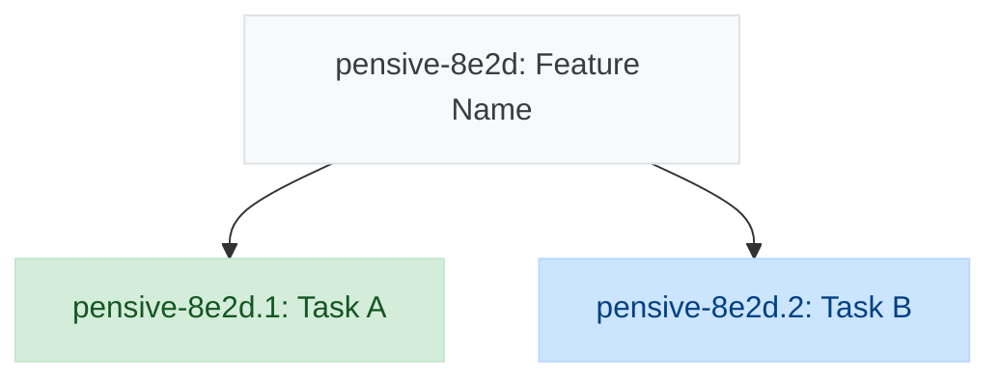

# Beads-Bridge Shortcut Sync Format Improvements

**Date:** 2025-11-10
**Issue:** pensive-f3v9
**Goal:** Improve the format and presentation of beads-bridge syncs to Shortcut stories

## Summary

Replace the current progress update format with a cleaner approach:
- **Diagrams** in story description "Yak Map" section (always current state)
- **Narrative comments** for progress updates (no metrics/charts)
- **Consistent colors** matching the live dashboard webview

## Requirements

### 1. Mermaid Diagram Styling
Use the same background colors as the live webview for task statuses:
- **Completed**: `fill:#d4edda,stroke:#c3e6cb,color:#155724` (green)
- **In Progress**: `fill:#cce5ff,stroke:#b8daff,color:#004085` (blue)
- **Blocked**: `fill:#f8d7da,stroke:#f5c6cb,color:#721c24` (red)
- **Default/Open**: `fill:#f8f9fa,stroke:#dee2e6,color:#383d41` (gray)

### 2. Yak Map Section Placement
Post Mermaid diagram to a "Yak Map" section in the story description:
- Section at bottom of story description
- Update in place (always shows latest state, not appended)
- Uses HTML comment markers: `<!-- YAK_MAP_START -->` / `<!-- YAK_MAP_END -->`

**Format:**
```markdown
<!-- YAK_MAP_START -->
---
## Yak Map



*Last updated: 2024-11-10 15:30 UTC*
<!-- YAK_MAP_END -->
```

### 3. Narrative Progress Comments
Simplify comments to focus on narrative instead of metrics:

**Include:**
- Brief notes about what changed (auto-generated)
- Current blockers (if any)
- What's next
- Optional user-provided narrative

**Remove:**
- Progress bar charts (████████░░░)
- "% complete" metrics
- Per-repository breakdowns

**Format:**
```markdown
## Progress Update

Completed 3 tasks since last update: Task A, Task B, Task C. Task X moved to in-progress. 2 tasks are currently blocked.

**Current Blockers:**
- 🚧 Task X is blocked by Task Y (in progress)
- 🚧 Task Z needs external dependency

**What's Next:**
- Start Task A (unblocked)
- Continue Task B (in progress)

[Optional user-provided narrative appears here]
```

Note: Shortcut already tracks comment timestamps, so no timestamp needed in comment.

## Architecture

### Approach: New ShortcutSyncOrchestrator

Create a dedicated orchestrator for Shortcut syncs that handles the complete workflow:

```
ShortcutSyncOrchestrator
├─ Dependencies:
│  ├─ BeadsClient (read Beads state)
│  ├─ ShortcutBackend (write to Shortcut)
│  ├─ MermaidGenerator (create diagrams)
│  └─ MappingStore (find epic mappings)
│
└─ Workflow:
   1. Read current Beads state (epics, tasks, dependencies)
   2. Generate Mermaid diagram with live webview colors
   3. Update story description's "Yak Map" section
   4. Generate narrative progress comment
   5. Post narrative comment
```

**Why this approach:**
- Single responsibility: owns complete "sync Shortcut story with Beads state"
- Clean separation from GitHub flow (which can adopt similar pattern later)
- Replaces current `ProgressSynthesizer.updateIssueProgress()` for Shortcut
- Follows YAGNI: build Shortcut-specific now, extract common patterns when GitHub needs same changes

### Interface

```typescript
class ShortcutSyncOrchestrator {
  async syncStory(
    storyId: number,
    options?: {
      userNarrative?: string;  // Optional user-provided narrative
    }
  ): Promise<SyncResult>
}
```

## Implementation Components

### New Files

1. **`src/orchestration/shortcut-sync-orchestrator.ts`**
   - Main orchestrator class
   - Coordinates: diagram generation → description update → comment posting
   - Methods: `syncStory()`, private helpers for narrative generation

2. **`src/types/sync.ts`**
   - `SyncResult` type
   - `SyncOptions` type
   - `NarrativeSection` types

3. **`src/utils/section-updater.ts`**
   - Reusable helper for updating marked sections in markdown
   - Methods: `findSection()`, `updateSection()`, `appendSection()`
   - Handles YAK_MAP_START/END markers

### Modified Files

1. **`src/skill.ts`**
   - **Rename class**: `BeadsGitHubSkill` → `BeadsSkill` (reflects multi-backend support)
   - Add `shortcutSyncOrchestrator?: ShortcutSyncOrchestrator` property
   - Instantiate ShortcutSyncOrchestrator when `config.backend === 'shortcut'`
   - Update `syncProgress` capability:
     - Route Shortcut requests → `shortcutSyncOrchestrator.syncStory()`
     - Keep existing GitHub flow unchanged

2. **`src/diagrams/mermaid-generator.ts`**
   - Update color scheme constants to match `dashboard.js` colors
   - Replace existing classDef colors with live webview colors

## Yak Map Section Update Logic

1. Fetch current story via `ShortcutBackend.getIssue()`
2. Parse description to find `YAK_MAP_START/END` markers
3. If found: Replace content between markers
4. If not found: Append section to end of description
5. Update story via `ShortcutBackend.updateIssue()`

## Narrative Generation Logic

**Auto-generated narrative** analyzes current Beads state and generates text like:
- "Completed 3 tasks since last update: Task A, Task B, Task C"
- "Task X moved to in-progress"
- "2 tasks are currently blocked"
- "5 open tasks remaining"

**Hybrid approach**: If `options.userNarrative` is provided, it gets appended after the auto-generated sections, allowing contextual notes the system can't infer (e.g., "Waiting for design review", "Performance issue discovered").

## Testing Strategy

### Unit Tests (Vitest)
- `shortcut-sync-orchestrator.test.ts` - Mock all dependencies, test workflow
- `section-updater.test.ts` - Test markdown section finding/updating logic
- `mermaid-generator.test.ts` - Verify color scheme matches dashboard

### Integration Tests
- Test with real Beads data (fixture files)
- Mock Shortcut API calls
- Verify complete workflow: read Beads → generate diagram → update description → post comment

### Manual Verification
- Test against real Shortcut story (e.g., story 89216)
- Verify Yak Map section appears correctly
- Verify colors match live dashboard
- Verify narrative comments are readable

## Error Handling

**Fail fast - no graceful degradation:**
- Any step failure → throw error and abort sync
- Clear error messages indicating which step failed
- No partial updates (e.g., don't post comment if description update failed)

**Validation:**
- Verify story exists before attempting sync
- Verify mapping exists (story linked to Beads epics)
- Validate Mermaid syntax before posting

**Logging:**
- Log all sync operations (timestamps, story ID, success/failure)
- Include full error details for debugging

## Backward Compatibility

- Existing GitHub issue sync continues to work unchanged
- Old Shortcut stories with diagram-in-comments won't break (new Yak Map section will be added)
- No breaking changes to public API

## Future Work

When GitHub needs similar changes:
1. Create `GitHubSyncOrchestrator` (similar pattern)
2. Extract common logic to base class or shared utilities
3. Use different section markers (e.g., `PROGRESS_DASHBOARD_START/END`)

## References

- **Current behavior**: Posts full metrics + diagram in comments
- **Related issues**:
  - pensive-aed8 (Convert beads-bridge to pure TypeScript) - parent issue
- **Live dashboard colors**: `src/frontend/dashboard.js` lines 139-142
